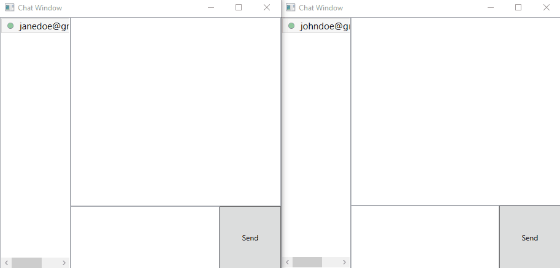

# SocketApps
Simple chat application for learning to build TCP/IP socket based applications

## Demo
  

## Setup instructions :

### Server setup :

1. Build the windows service project present in the path "master/SocketServerWinService"
2. Install the windows service by following instructions in the file path "master/SocketServerWinService/ServiceInstructionsReadme.txt"
3. Create a firebase account for authentication service, and store the WebapiKey under the machine environment variable "ChatServerFirebaseApiKey"

### Additional router settings for use of chat application over internet :
1. Port forwarding must be enabled on your router, follow similar steps as presented in the path "master/AdditionalConfigsProcesses/HathwayRouterSetup" in the server router.

### Client setup :
1. Change the appSetting "ServerIP" to the server IP address, present in the file "master/ClientDesktopUI/App.config"
2. Build the project "master/ClientDesktopUI"
3. Build the installer project "master/ClientDesktopUISetup" (Requires Visual studio installer projects extension to be installed)
4. Run the setup and install the chat application on all the client computers
